# HumourOnBibleStories

The HumourOnBibleStories website is for anyone that has interest in the Bible that is looking for fun. The website stimulates interest and brings laughter when you think about what the Bible characters would do if they lived in an animated and funny world.
At the same time the website expect the player to input answers as close a as possible to the actual events in the bible. The game also gives feedback on what the correct answer should have been when you are wrong.  To play Click any of the bible charactor names and answer the random question displayed by droping down to select your answer and then click submit button.The game is won when you have answered 5 questions CORRECTLY in any charactor order. The game is lost if you answer incorrectly 3 times.

## Various Devices View

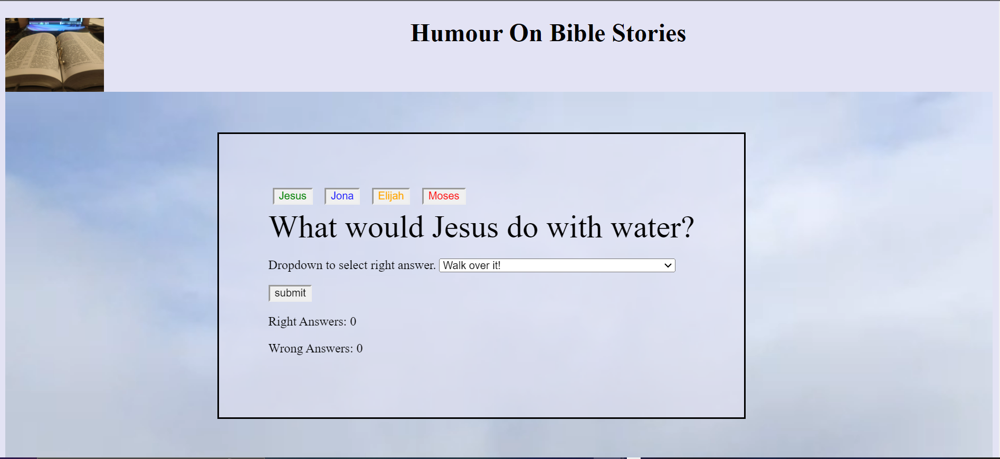

## Features

### The header
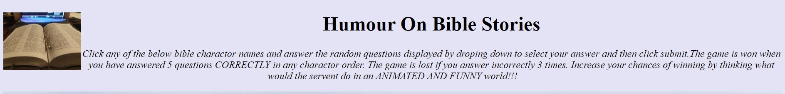
• At the very top of the page the header reveals the game name:Humour On Bible Stories. The font is a bit settle and conservative. It has an emphised font and guide on how you can play and win the game.
• The background video is the signature of the game as it give it life and closer to God sensation as you travel through the clouds. But we can be sure God has a sense of humour and this is what the game is about.
• But the red green blue orange and black colours on the butto give the game life and the animation view and feel.

### The Game Options
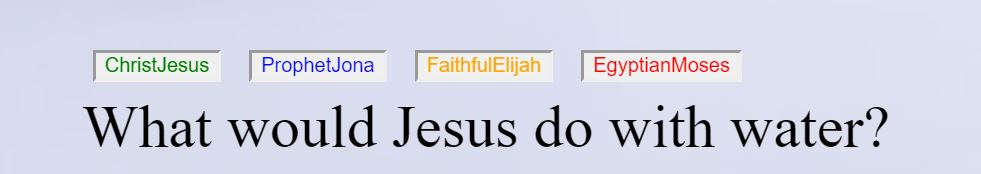

• The Game Options allows the player to select any on the four characters from the bible.
• Based on their choice of character they are then given a relevant question, Jesus relevant question if ChristJesus button is selected for an example.
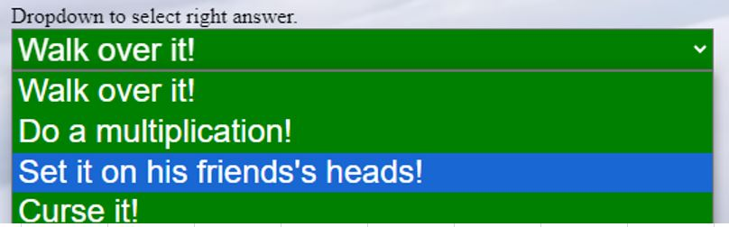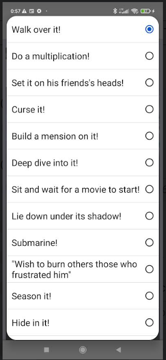
• There is an instruction to drop down on the form and
• A list of options pops up and the user must choose the option that answers the question relevant to the character they chose at the begging of the game.

• A submit button must be clicked for the answer to be checked.
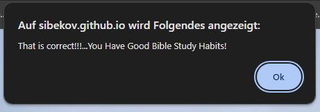
• The above alert shows when questions were answered correctly. With an incouraging comment of good bible study habits.The play should press ok on the alert once read.

• The above alert shows when questions were answered incorreclty. With an additional comment on what the correct answer is for the user to learn in the process. The play should press ok on the alert once read.
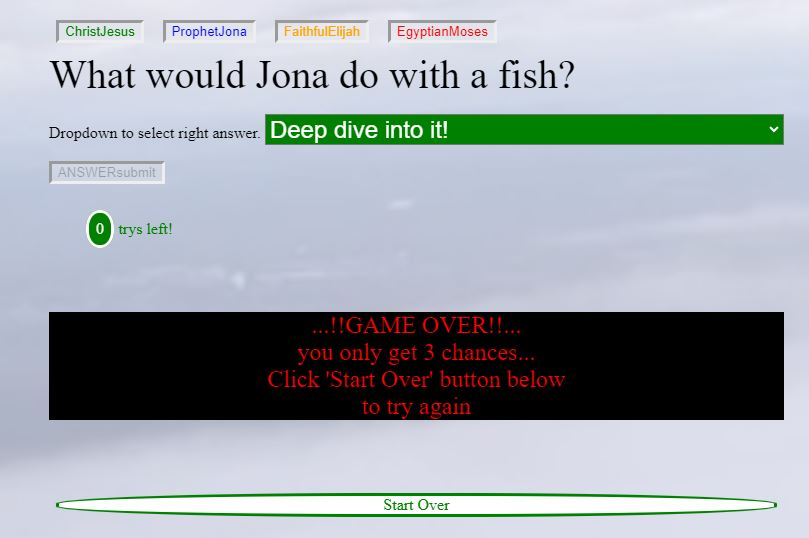
• In the middle of the screen a game over message will appear and all buttons will be frozen if the user guessed wrong answers three times.  The start over button will need to be clicked if the player once to try again. The start over button is explained below.
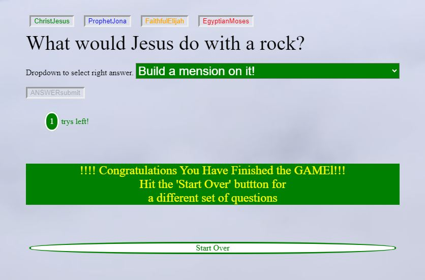
• In the middle of the screen winning  message will appear congratulating you on finishing the game and also all buttons will be frozen if the user guessed correct answers five times.  The start over button will need to be clicked if the player once to try again. The start over button is explained below.
### The Submit button.

• Start over button above, when clicked, refreshes the page any time the player wishes to start afresh.

• The number of trys left button decrements eachtime you select the wrong answer and increments each time player got the right answer. This helps the user to be more careful.

### The Game Results

• Are Split into two. If the user answered correctly then the counter score call right Answers get incremented.
• While if the user answered incorrectly then the Wrong Answers score gets incremented.

### The footer

• The footer keeps score count and display both the wrong attempts and the right attempts.  

## Testing

### JSHint Validator

JSHint JavaScript Validator – Only warnings and no errors. see below snip:

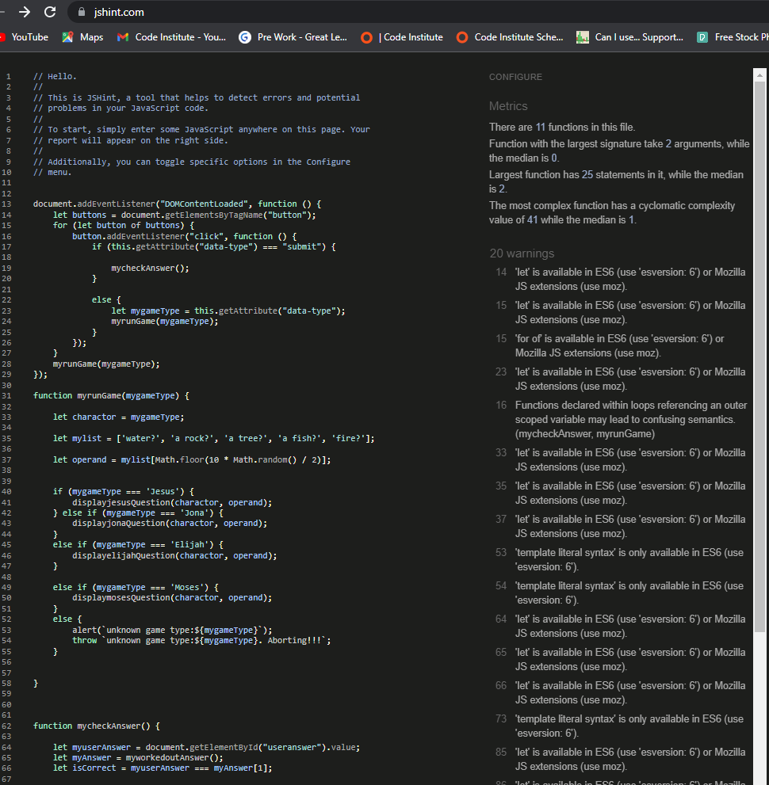

### W3C HTML Validator

W3C HTML Validator picked up a bug when validating my HTML directly on W3C HTML Validator. An astray closing style tag was picked up from line 29.

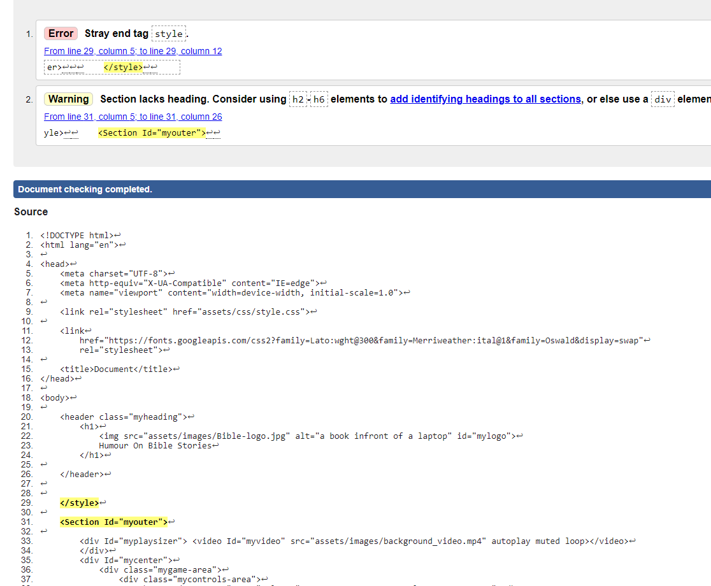

The bug deleted and code updated as per below screen, only a warning is left and not errors:

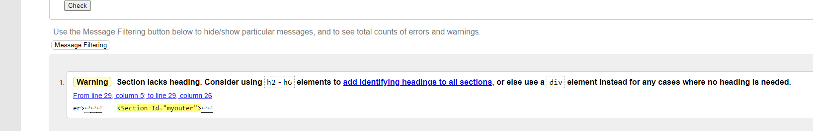

### W3C CSS Validator (Jigsaw)

CSS also passes with no errors as per below snip, when testing was done with W3C CSS Validator.

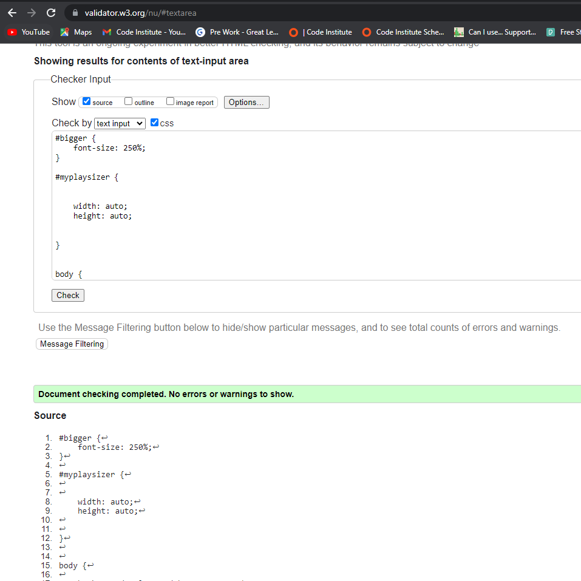

### DevOPS Light House

The Light House from the DevOps helped to Identify fundamental problems. The below showed that my buttons were not fully accessesable. This is due to inner text missing. Only reaching 77% accessibility which is obviously not good enough.

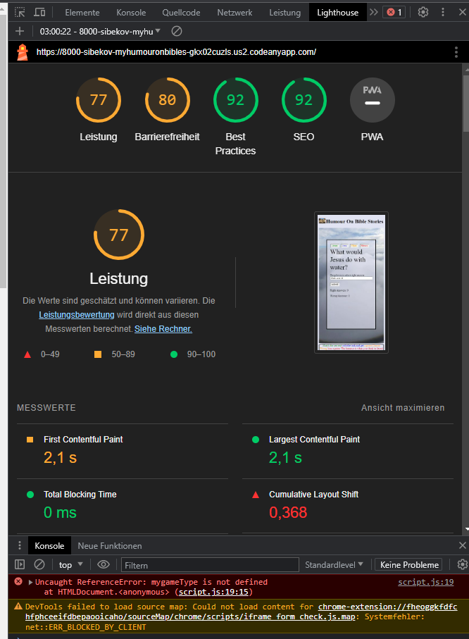

Adding the relevant inner HTML improves accessability to 95% as It can be seen below:

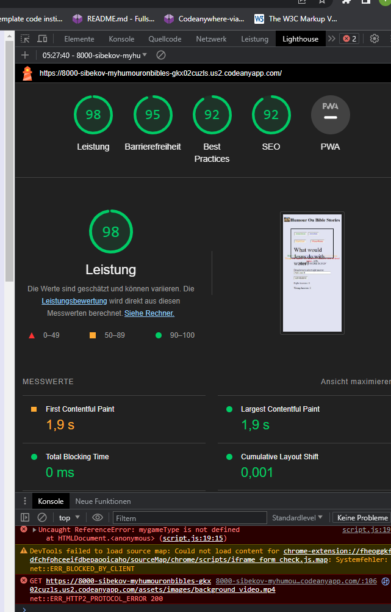

## Unfixed Bugs

### GAME OVER

GAME OVER Not implemented. While the game is able to give feedback on both wrong and right answers, it actually does not end. I was out of time to implement GAME OVER code. The counter is already at the bottom of the game area but still need to investigate how to use DOM, CSS and JS to make it work and also look beautiful.

### Exclusion of passed stages

Exclusion of passed stages from the next level not implemented. Random method in JS has the option to call back previously selected options. Will Explore improved random methods that factor in unknown length.

### Repeating code

Repeating code. The code as is can be reduced with different data structures like the objects methods. But the act of writing some what repeated code was intentional as I wanted to reduce de drop down list from 20 options per four operands to 5 options per 4 operands. There by spacing the code nicely and preparing it for future updates.

### High Data Usage data

The Video and Logo uses too much data they are not compressed. I did not get time to do this. They are still in their raw format.

## Deployment

The site was deployed to GitHub pages. The steps to deploy are as follows:

• In the GitHub repository navigate to the setting tab
• On the left most side menu click on pages
• Source should be deploy from a branch
• Under branch select main
• Save git pages saved
• Refresh page
• Your site link will show in less than 10 min.

## Credits

### Anna Greaves

The code is inspired by the Love Running and Love Maths Code Institute walkthrough Project videos delivered by Full Stack Web developer and content creator, Anna Greaves.

### Matt Rudge

The CSS code on the footer was partly taken from the Rock, Paper, Scissors game walk through project presented by Matt Rudge, Senior Product Developer at code institude.

### fonts.google

The fonts used on the site were taken from Google fonts website https://fonts.google.com/

### quora

Needed to know the name of the unclean fish forbidden for ancient Israel got the answered from the quara website cited as follows: https://www.quora.com/Why-does-the-Bible-say-not-to-eat-fish-without-scales

## w3schools

I tried but failed to implement the suggestions on W3schools website to style my throw and alert, they are currently just using temperate literals and they are dull and ugly will give this website another visit when I get time: https://www.w3schools.com/js/js_popup.asp

### stackoverflow

I also tried to slow down the background video but did not see the difference, I tried the suggestions from stackoverflow below but still could not realise the difference. Will follow additional comments in future from the same site:
https://stackoverflow.com/questions/3027707/how-to-change-the-playing-speed-of-videos-in-html5

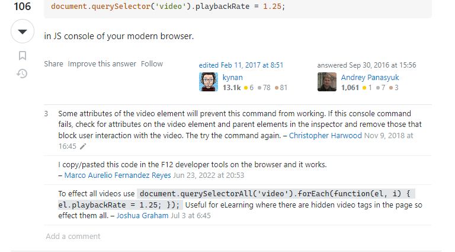

Tried to read through the perfect random but did not work out nicely for me so I excluded it but the stackoverflow site was really help full:
https://stackoverflow.com/questions/19269545/how-to-get-a-number-of-random-elements-from-an-array

### dequeuniversity

Reading more about buttons helped me to resolve the final bug of the project. My game relied on DOM and CSS for submission, how ever the button element still requires inner text, HTML standard. The below dequeuniversity website was very helpful:
https://dequeuniversity.com/rules/axe/4.6/button-name

## Media

### Linda Sibeko,

The background video was taken by my child, Linda Sibeko, as we were landing to my foreign country after a long holiday.

### Vusimuzi Sibeko

I have taken a picture of my bible and reduced it to 10% in width and in height to make the picture logo.
